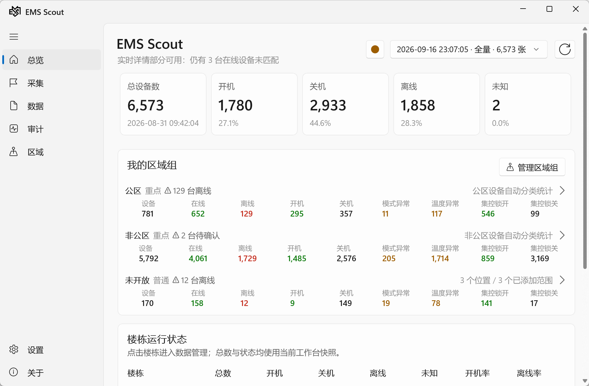
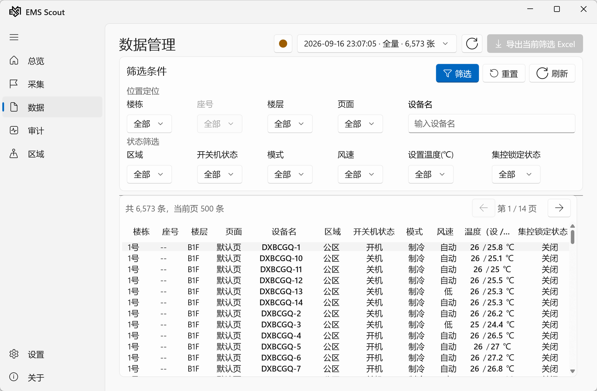
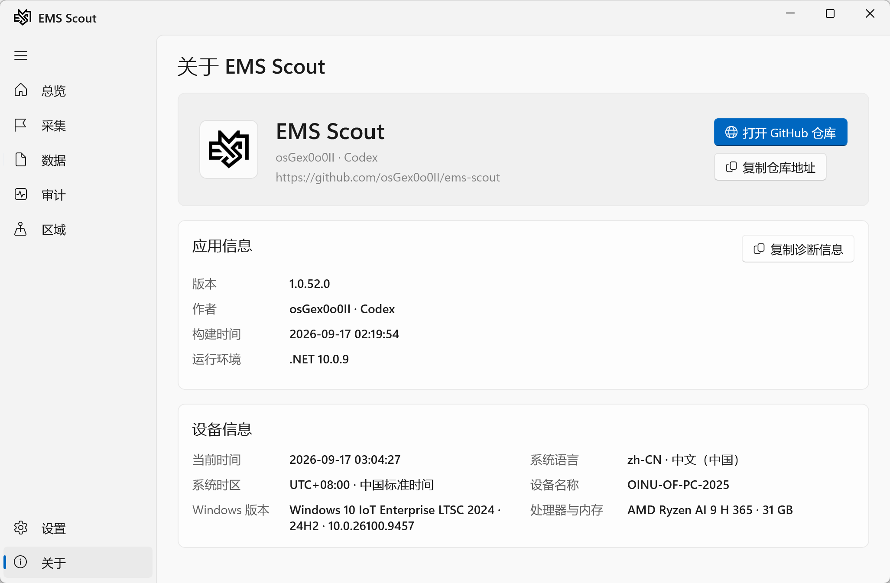

<p align="center">
  
</p>

<h1 align="center">EMS Scout</h1>

<p align="center">
  <em>現場の空調状態を収集し、監査し、追跡可能に。</em>
</p>

<p align="center">
  <a href="package.json"></a>
  <a href="https://nodejs.org/"></a>
  <a href="https://learn.microsoft.com/windows/apps/winui/winui3/"></a>
  <a href="https://www.sqlite.org/"></a>
</p>

<p align="center">
  <a href="README.md">简体中文</a> ·
  <a href="README.en.md">English</a>
</p>

---

## 主な機能

| 現場収集 | リアルタイム監査 | SQLite 履歴 | Windows Native | Excel 出力 |
| --- | --- | --- | --- | --- |
| 6 棟 | 46 リアルタイム項目 | バッチスナップショットと復元 | データ管理と診断 | 13 列の棟別シート |

## ワークフロー

```text
EMS ページ → 列挙 → 品質検証 → SQLite → リアルタイム監査 → Excel
```

## 実際の画面

### 概要

<p align="center">
  
</p>

### データ管理

<p align="center">
  
</p>

### アプリについて

<p align="center">
  
</p>

## プロジェクト構成

```text
.
├── src/                              # Node.js 収集、ルール、履歴コア
│   ├── enumerate.js                  # Playwright + Edge CDP メイン列挙器
│   ├── enum-validator.js             # 列挙結果とデバイス識別の検証
│   ├── rules.js                      # 状態、エリア、品質ルール
│   ├── realtime-quality.js           # リアルタイム項目と raw 値の監査
│   └── data-history.js               # SQLite 履歴と復元
├── scripts/                          # インポート、収集、監査、現場検証
├── native/
│   ├── src/EmsScout.Desktop/         # WinUI 3 ネイティブ UI
│   ├── src/EmsScout.Application/     # ユースケース、クエリ、契約
│   ├── src/EmsScout.Domain/          # デバイス、棟、状態モデル
│   ├── src/EmsScout.Infrastructure/ # SQLite、ファイルソース、Excel 出力
│   └── tools/EmsScout.ExportSmoke/   # Excel 出力スモークテスト
├── data/                             # ローカル棟別データ（リモート管理対象外）
├── docs/                             # アーキテクチャ、データモデル、画面
├── config/                           # 品質監査設定
├── README.md                         # 中国語ドキュメント
├── README.en.md                      # English documentation
├── README.ja.md                      # 日本語ドキュメント
├── package.json                      # Node.js スクリプトと依存関係
└── CHANGELOG.md                      # 変更履歴
```

## ファイル説明

| ファイル | 役割 |
| --- | --- |
| [`src/enumerate.js`](src/enumerate.js) | Playwright、Edge CDP、SVG、Vue データからデバイスカードを列挙します。 |
| [`src/verify-live.js`](src/verify-live.js) | ブラウザの現在状態と SQLite を照合します。 |
| [`src/rules.js`](src/rules.js) | 電源状態、エリア、棟の識別、カード品質を判定します。 |
| [`src/enum-validator.js`](src/enum-validator.js) | 棟の範囲、件数、ページ、重複、インポート条件を検証します。 |
| [`src/realtime-quality.js`](src/realtime-quality.js) | リアルタイム項目、列挙値、温度範囲、ロック raw 値を監査します。 |
| [`src/data-history.js`](src/data-history.js) | SQLite の履歴、メタデータ、現行データ復元を管理します。 |
| [`scripts/import.js`](scripts/import.js) | 列挙 JSON を SQLite にインポートします。 |
| [`scripts/collect-realtime-all-batch.js`](scripts/collect-realtime-all-batch.js) | 6 棟のリアルタイム収集、進捗、監査を調整します。 |
| [`scripts/collect-building-realtime-details.js`](scripts/collect-building-realtime-details.js) | 1 棟分のリアルタイム詳細を収集します。 |
| [`scripts/collect-building-realtime-batch.js`](scripts/collect-building-realtime-batch.js) | 1 棟分のリアルタイム収集バッチを実行します。 |
| [`scripts/realtime-browser.js`](scripts/realtime-browser.js) | リアルタイム収集用の Edge と CDP セッションを管理します。 |
| [`scripts/quality-report.js`](scripts/quality-report.js) | 列挙品質レポートを生成します。 |
| [`scripts/audit-realtime-data.js`](scripts/audit-realtime-data.js) | リアルタイムデータと異常 raw 値を監査します。 |
| [`scripts/field-e2e.ps1`](scripts/field-e2e.ps1) | 一時出力と一時 SQLite を使って現場検証を実行します。 |
| `native/src/EmsScout.Desktop` | 概要、収集、データ管理、監査、設定、診断ページ。 |
| `native/src/EmsScout.Infrastructure` | SQLite、リアルタイムスナップショット、品質監査、Excel 出力。 |
| `native/tests/EmsScout.Tests` | ネイティブアプリ、履歴、Excel 出力契約のテスト。 |
| [`docs/architecture.md`](docs/architecture.md) | レイヤー構成とデータフロー。 |
| [`docs/data-model.md`](docs/data-model.md) | データベースと Excel 出力モデル。 |
| [`CHANGELOG.md`](CHANGELOG.md) | 変更履歴と現場検証記録。 |

## 謝辞

- [Windows App SDK](https://github.com/microsoft/WindowsAppSDK) と WinUI 3
- [Node.js](https://nodejs.org/) と [Playwright](https://playwright.dev/)
- [better-sqlite3](https://github.com/WiseLibs/better-sqlite3)
- [SheetJS](https://sheetjs.com/)
- SmartPiEMS の現場システムと検証環境

## ライセンス

プロジェクトは `package.json` で **ISC License** と宣言されています。リポジトリには現在、独立した `LICENSE` ファイルはありません。
